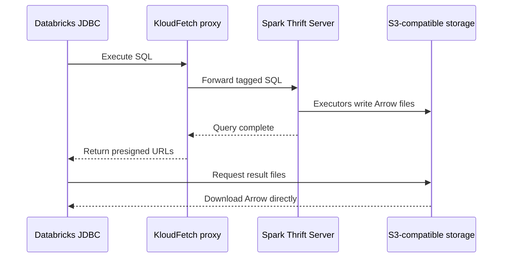

# KloudFetch

[](https://github.com/nicosuave/kloudfetch/actions/workflows/ci.yml)

KloudFetch has **two required components**:

1. **A JDBC/Thrift proxy.** The Databricks JDBC driver connects to this proxy,
   not directly to Spark. The proxy forwards SQL to Spark and returns
   Databricks-compatible `TSparkArrowResultLink` responses.
2. **A Spark extension.** This JAR runs inside Spark. For queries tagged by the
   proxy, Spark executors serialize result partitions as Arrow and upload them
   directly to S3-compatible storage.

The proxy handles Databricks wire compatibility; the Spark extension handles
distributed result generation. Both are required. Large result bytes travel
directly from S3 to the JDBC client and do not pass through the proxy.



The extension is loaded with Spark's `spark.sql.extensions` configuration, so
KloudFetch does not require a custom Spark distribution.

## Compatibility

The following matrix is tested end-to-end in GitHub Actions on every push and
pull request:

| Component | Tested versions |
| --- | --- |
| Apache Spark | `3.5.9`, `4.0.4`, `4.1.3`, `4.2.0` |
| Databricks JDBC | `3.0.1`, `3.0.3`, `3.0.4`, `3.0.5`, `3.0.6`, `3.0.7`, `3.1.1`, `3.2.1`, `3.3.1`, `3.3.3`, `3.4.1`, `3.4.2` |
| Object storage | Amazon S3 API; CI uses RustFS |

All 48 Spark/JDBC combinations run against the real Docker stack: Spark Thrift
Server, the KloudFetch proxy, RustFS, and the unmodified Databricks JDBC driver.
The test executes SQL through JDBC, receives Cloud Fetch links, downloads the
Arrow files from object storage, and validates row ordering and values.

The newest JDBC driver additionally covers nested and temporal types, decimals,
binary data, nulls, empty results, and schema isolation on every Spark version.
Databricks JDBC 2.x is the separate legacy Simba driver and is not supported by
this OSS-driver compatibility matrix.

## Production status

**Status: beta / production candidate. KloudFetch is not yet presented as a
production-ready service.**

What has been demonstrated:

- 48 end-to-end Spark/JDBC compatibility combinations in GitHub Actions
- a verified 10 GiB result through the unmodified Databricks JDBC driver, with
  multipart Arrow uploads and result bytes bypassing the proxy
- bounded concurrency, cancellation, proxy restart, executor loss, task retry,
  partial-upload recovery, expired-URL, and cleanup tests
- object-store-backed operation state that supports multiple proxy replicas

Before a production deployment, the operator should still:

- run a sustained soak test against the actual S3-compatible provider, Spark
  cluster, network, and consumer workload
- deploy TLS, production authentication, secret management, least-privilege
  object-store credentials, and the required KMS or encryption policy
- add deployment-specific metrics, traces, alerts, dashboards, SLOs, capacity
  limits, and backpressure
- validate rolling upgrades, rollback, disaster recovery, lifecycle rules, and
  cleanup under the chosen orchestrator
- complete the organization's security and operational review

The included Compose stack is a reproducible compatibility, performance, and
failure test environment. It deliberately uses test credentials and plaintext
local transport; it is not a hardened production deployment.

## Development stack

The included stack runs Spark 4.1.2 against RustFS:

```bash
docker compose up --build
```

The Databricks JDBC endpoint is:

```text
jdbc:databricks://localhost:10000/default;transportMode=http;ssl=0;AuthMech=3;httpPath=/cliservice;UID=token;PWD=test-token
```

Add `EnableComplexDatatypeSupport=1` when consuming arrays, maps, or structs.
RustFS serves the S3 API on port 9000 and its console on port 9001.
Set `KLOUDFETCH_RUSTFS_DATA_DIR` to an absolute host path to use a bind mount
instead of the default named Docker volume.

Run the compatibility test with the real Databricks OSS JDBC driver:

```bash
docker compose --profile test run --rm jdbc-test
```

The test checks 50,000 ordered rows plus integer, decimal, date, boolean, and
null values. The JDBC driver—not test-specific code—downloads and decodes the
presigned Arrow chunks.

Additional compatibility and failure-path harnesses are available in the same
profile:

```bash
docker compose --profile test run --rm jdbc-types
docker compose --profile test run --rm jdbc-concurrency
docker compose --profile test run --rm jdbc-cancel
docker compose --profile test run --rm jdbc-restart
docker compose --profile test run --rm expiry-test
```

An optional `cluster` Compose profile starts a Spark standalone master and two
workers. It exists for executor retry/speculation testing; the ordinary local
stack remains the default.

## How it works

1. The proxy wraps eligible read queries in an internal `KLOUDFETCH` optimizer
   hint and forwards the request to the stock Spark Thrift Server.
2. `KloudFetchSparkExtension` preserves the query's output schema but replaces
   the physical result collection with a partition-local Arrow spool operator.
3. Executors write complete Arrow IPC streams and small JSON sidecars through
   Hadoop S3A. Partition and batch numbers give the result a deterministic
   order.
4. On the first `FetchResults`, the proxy discovers the immutable manifest,
   reads sidecars concurrently, and adds a page of presigned
   `TRowSet.resultLinks` at the Databricks field ID `1282`. Spark's Arrow
   schema metadata is returned at Databricks field ID `1283`, including the SQL
   type names the driver needs to decode complex types.
5. The unmodified Databricks driver downloads and decodes the Arrow streams.

The proxy stores the upstream operation handle, metadata, acknowledgement
offset, paging cursor, and cleanup deadline in small encrypted S3 records.
Conditional `If-Match` writes provide compare-and-swap updates across proxy
replicas, so operation routing does not depend on process-local memory.

Queries whose optimizer estimate is below
`spark.kloudfetch.minEstimatedBytes` retain Spark's normal inline result path.
The Docker development stack sets the threshold to zero so every eligible
query exercises Cloud Fetch.

## Configuration

Spark:

- `spark.sql.extensions=org.apache.spark.sql.kloudfetch.KloudFetchSparkExtension`
- `spark.kloudfetch.bucket`
- `spark.kloudfetch.prefix` (default `results`)
- `spark.kloudfetch.minEstimatedBytes` (default `0`)
- `spark.kloudfetch.maxRecordsPerBatch` (default `250000`)
- `spark.kloudfetch.maxEstimatedBatchBytes` (default 64 MiB)
- Hadoop S3A fast/multipart upload is enabled with 16 MiB parts and bounded
  in-memory part buffers
- S3 server-side encryption defaults to `AES256`

All Spark drivers and executors must use the exact same KloudFetch extension
JAR. Updating only the Thrift Server image can produce serialized-plan class
version mismatches on already-running workers.

Proxy:

- `KLOUDFETCH_UPSTREAM_HOST`, `KLOUDFETCH_UPSTREAM_PORT`
- `KLOUDFETCH_PASSWORD`
- `KLOUDFETCH_S3_ENDPOINT_URL`
- `KLOUDFETCH_S3_PUBLIC_ENDPOINT_URL`
- `KLOUDFETCH_S3_BUCKET`, `KLOUDFETCH_S3_PREFIX`
- `KLOUDFETCH_URL_TTL_SECONDS`
- `KLOUDFETCH_CLEANUP_DELAY_SECONDS`
- `KLOUDFETCH_CLEANUP_INTERVAL_SECONDS`
- `KLOUDFETCH_OPERATION_MAX_AGE_SECONDS` (default `86400`)
- `KLOUDFETCH_STATE_PREFIX` (default `kloudfetch-state`)
- `KLOUDFETCH_MANIFEST_WORKERS` (default `16`)
- `KLOUDFETCH_MAX_LINKS_PER_FETCH` (default `16`; keep this below the
  Databricks JDBC driver's default 32-chunk in-memory window)
- `KLOUDFETCH_LIFECYCLE_DAYS` (default `1`; S3 safety-net expiry)

## Current scope

KloudFetch targets the HiveServer2 HTTP transport used by the Databricks OSS
JDBC driver. Read-only `SELECT`, `WITH`, `VALUES`, and `TABLE` statements are
eligible for offload. Metadata and mutating statements remain on Spark's
ordinary path. Presigned URLs expire, and objects are scheduled for deletion
after the operation closes. A periodic object-store sweep also removes stale
prefixes left by failed jobs or proxy restarts. Fetch offsets are tracked as
download acknowledgements; `CloseOperation` is the definitive acknowledgement
that schedules deletion. Deterministic object names make task retry and
speculative attempts safely overwrite equivalent partition batches.

## Validation

On a Docker VM with 18 ARM64 CPUs and 15.7 GiB RAM, backed by local RustFS:

- 100 MiB: 2.664 seconds, 37.54 MiB/s
- 1 GiB: 2.892 seconds, 354.05 MiB/s
- 2 GiB pagination regression: 3.970 seconds, 515.93 MiB/s
- 10 GiB: 16.321 seconds, 627.43 MiB/s

The 10 GiB run validated 1,310,720 ordered rows through the unmodified
Databricks JDBC 3.4.2 driver. It produced 176 Arrow objects; all 176 reported
SSE-S3 `AES256`, and 160 full chunks used four-part multipart uploads. RustFS
transferred 10.8 GB while the proxy transferred under 0.5 MB, confirming that
result bytes bypass the Thrift service.

The same environment was also exercised through the unmodified Databricks JDBC
3.4.2 driver for:

- decimal(38,9), timestamp, timestamp without timezone, binary, Unicode,
  arrays, maps, structs, typed nulls, empty results, and differing sequential
  result schemas on one connection
- 1,000 concurrent queries across two proxy replicas, totaling about 4 GiB of
  payload in 41.609 seconds
- cancellation of a running 10 GiB-shaped query, including Spark job
  cancellation and operation cleanup
- proxy restart before fetching and during a 4 GiB result download
- executor loss during a 512 MiB query, with the lost task retried on the
  surviving worker and the full ordered result verified
- an injected half-written Arrow upload followed by task retry and successful
  verification of a 256 MiB result
- expired presigned URL rejection followed by a successful fresh signature

The automated Python suite includes a proxy-state recreation test to verify
that operation cursors and cleanup deadlines survive process replacement.
